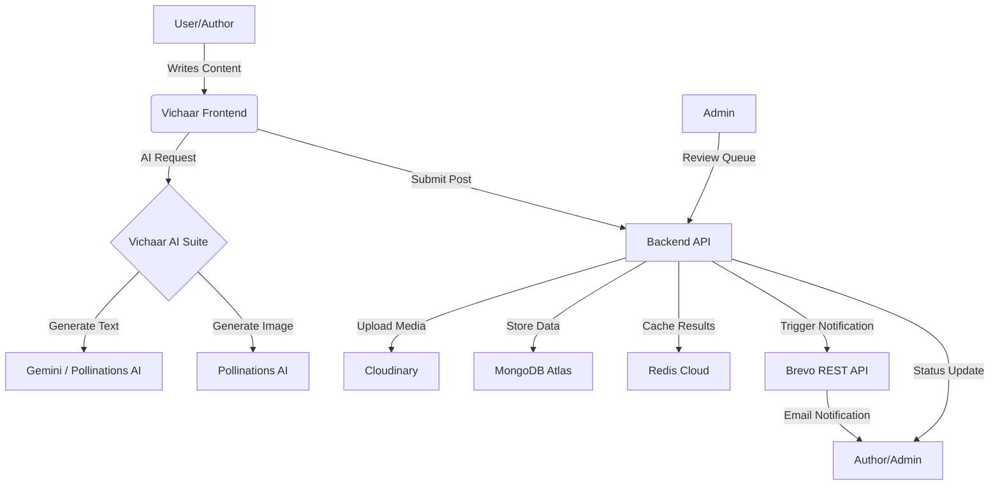

# 🚀 Vichaar: AI-Powered Premium Blogging Platform

Vichaar is a state-of-the-art blogging ecosystem that merges high-end design with advanced AI capabilities. It's designed for creators who want a professional, feature-rich platform to share their thoughts, manage their audience, and leverage AI for content creation.

---

## 🏗 Architecture & Flow

### System Workflow

### Content Lifecycle
1.  **Drafting**: Author writes a post using the Tiptap-powered editor.
2.  **AI Enhancement**: AI expands content, performs SEO audits, and generates cinematic cover images.
3.  **Submission**: Post is uploaded to the cloud (Media to Cloudinary, Data to MongoDB).
4.  **Moderation**: Admin reviews the post in the **Pending Queue**.
5.  **Publication**: Once approved, the post goes live and is cached in Redis for high-performance reading.

---

## ✨ Key Features

### 🎨 Creative Suite (AI-Powered)
*   **AI Writing Assistant**: Expand, rewrite, or polish your content with professional AI styles.
*   **AI Image Generator**: Generate cinematic, 4K blog covers based on your title.
*   **SEO Audit**: Automatic SEO scoring and meta-tag generation.

### 💳 Pro Features & Monetization
*   **Premium Membership**: Integrated **Razorpay** payment gateway for subscription management.
*   **Gated Content**: Toggle posts as "Premium Only" for subscribers.
*   **Advanced Analytics**: Track views, likes, and engagement metrics via a dynamic dashboard.

### 🛠 Robust Infrastructure
*   **Cloud Media**: Seamless image handling via **Cloudinary**.
*   **Smart Caching**: Lightning-fast page loads using **Redis**.
*   **Secure Auth**: JWT-based authentication with secure HTTP-only cookies.
*   **Transactional Emails**: Reliable notifications via **Brevo REST API**.

---

## 🛠 Tech Stack

| Layer | Technology |
| :--- | :--- |
| **Frontend** | React, Tailwind CSS, Framer Motion, Ant Design, Three.js |
| **Backend** | Node.js, Express, TypeScript, Multer, Axios |
| **Database** | MongoDB (Mongoose), Redis (Caching) |
| **AI/ML** | Gemini AI, Pollinations API |
| **Services** | Cloudinary (Media), Brevo (Email), Razorpay (Payments) |

---

## 🚀 Getting Started

### Prerequisites
*   Node.js (v18+)
*   MongoDB Atlas Account
*   Cloudinary Account
*   Brevo API Key

### Backend Setup
1.  Navigate to `server/` and install dependencies: `npm install`.
2.  Configure `.env` using the provided `.env.example`.
3.  Run the server: `npm run dev`.

### Frontend Setup
1.  Navigate to `Vichaar/` and install dependencies: `npm install`.
2.  Configure `.env` with your backend URL.
3.  Run the app: `npm run dev`.

---

## 📄 License
This project is licensed under the ISC License.

---
Developed with ❤️ by the Vichaar Team.
